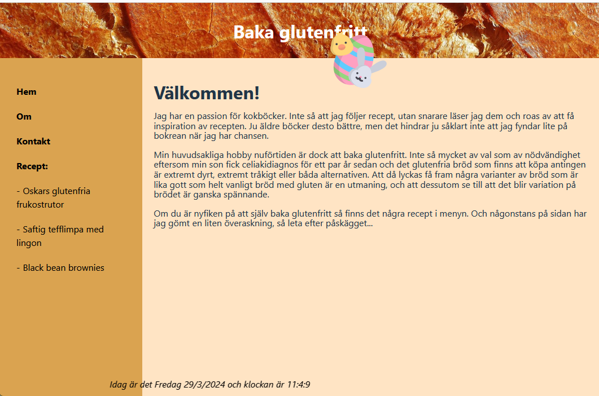
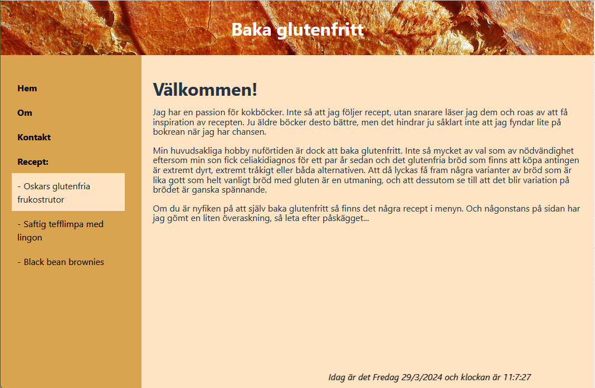
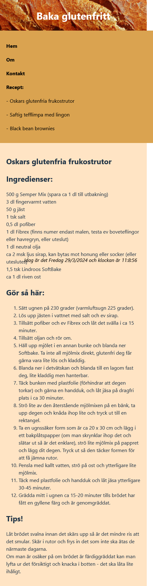

# Min hobby  
### Git-övning för YH-utbildning Front End Developer (Medieinstitutet)

Detta projekt utvecklades som en skoluppgift där huvudsyftet är att träna på användning av Git för versionshantering och samarbete.  
Under utvecklingen av detta projekt har jag använt mig av olika Git-funktioner och kommandon för att lära mig hur jag utför alla dessa steg via terminal istället för via visuella metoder i Visual Studio Code och på gitHub.  


## Processen
För att kunna prova på alla dessa kommandon behövdes ett ständigt växande innehåll, så basen för hela projektet var en sida om en hobby. Just i detta fall valde jag att göra en kort sida om att baka glutenfritt, delar med mig av ett fåtal recept och slängde för skojs skull in ett easter egg som man bara behöver hitta för att få ett extra recept på en god chokladtryffel.   
Jag startade ett enkelt projekt bestående av enbart grundläggande dokument i **Visual Studio Code** och körde det som ett **Vite**-projekt för att kunna se i realtid hur mina ändringar tillämpades.   


### Initialisering och ändringar 
Jag började med att initialisera ett nytt Git-repository med ````git init```` och klonade sedan ett befintligt repository från gitHub med ````git clone````. För att hantera ändringar använde jag ````git add```` för att lägga till ändringar i arbetskatalogen till indexet och ````git commit```` för att spara ändringar i indexet till repositoryt.

### Branch-hantering
Branch-hantering är en viktig del av projekt, så jag skapade och hanterade branches med ````git branch```` och ````git checkout```` för att växla mellan branches och säkerställa att jag var på rätt branch och arbetade. För att sammanfoga innehållet från en branch till en annan använde jag till största delen ````git merge````.

### Cherry-pick och rebase
För att prova på att applicera en enskild commit från en gren till en annan använde jag ````git cherry-pick````, och för att sammanfoga commit-historiken linjärt på en branch provade jag på ````git rebase````.

## Övrig kod
För att mitt projekt skulle få lite innehåll valde jag att skapa 4 filer:
* **_index.html_** för grundläggande struktur
* **_main.js_** för att dynamiskt skapa innehållet till sidan med funktioner, och placera det där jag vill ha det
* **_recipe.js_** med en array för tre enkla, glutenfria recept att visa på sidan
* **_style.css_** för att ge sidan en grundläggande styling och skapa en responsiv design med flexbox

## Screenshots

**Screenshot av desktop-vy med easter egg**  


**Screenshot av desktop-vy med hover** 

  
**Screenshot av mobil-vy med recept**  

### Summering
Genom denna övning har jag lärt mig grunderna i git med kommandon för att kunna köra dem i terminalen. Kursen har gett mig en förståelse för vad som händer i bakgrunden med git, även om jag i fortsättningen till större delen kommer fortsätta använda de visuella gränssnitten som finns i tex Visual Studio Code och på gitHub. Det har varit en väldigt intressant och inspirerande övning för min fortsatta utbildning.